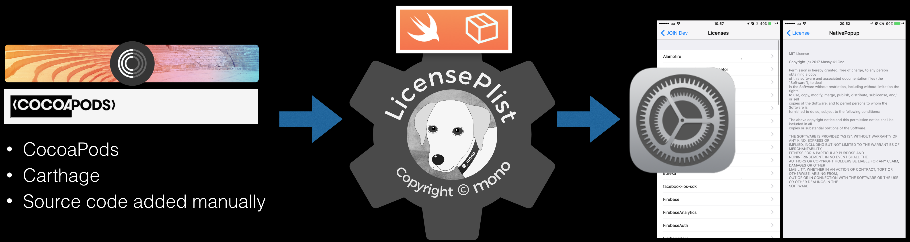
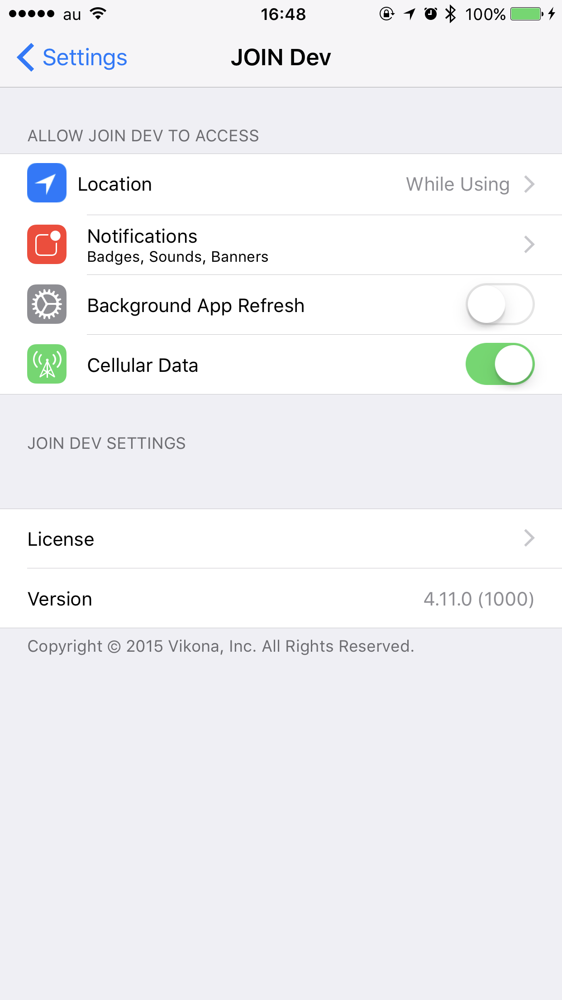
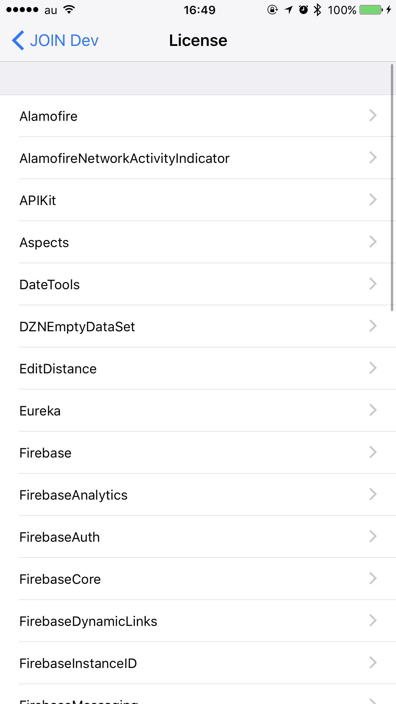
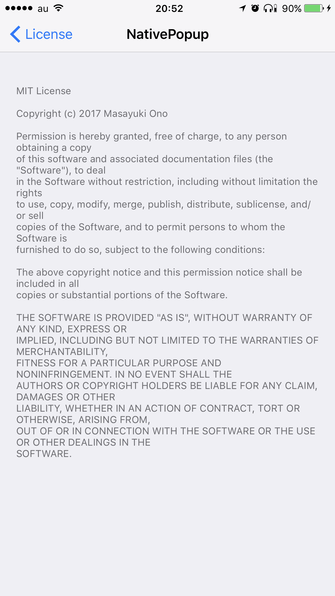
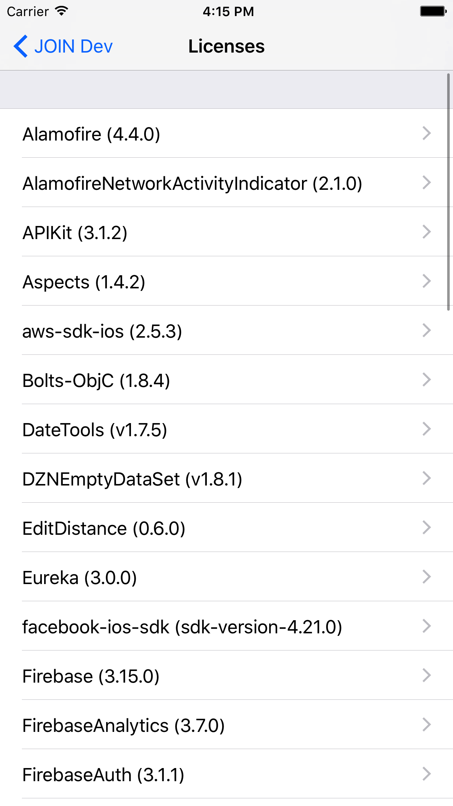
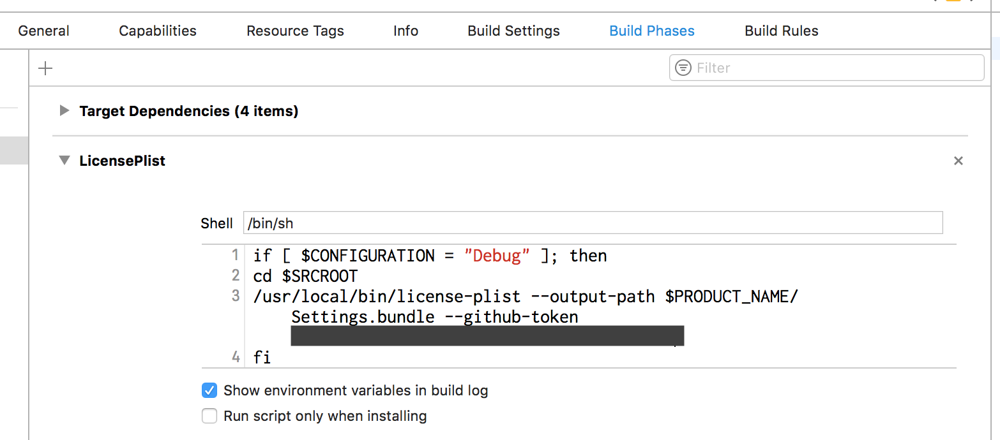

 LicensePlist
======================================


[](https://raw.githubusercontent.com/mono0926/NativePopup/master/LICENSE)
[](https://developer.apple.com/swift)
[](https://github.com/apple/swift-package-manager)

[](https://github.com/mono0926/LicensePlist/actions/workflows/lint.yml)
[](https://github.com/mono0926/LicensePlist/actions/workflows/test.yml)

`LicensePlist` is a command-line tool that automatically generates a Plist of all your dependencies, including files added manually(specified by [YAML config file](https://github.com/mono0926/LicensePlist/blob/master/Tests/LicensePlistTests/Resources/license_plist.yml)) or using `Carthage` or `CocoaPods`. All these licenses then show up in the Settings app.




| App Setting Root          | License List              | License Detail              |
| ------------------------- | ------------------------- | --------------------------- |
|  |  |  |

## Installation

> **Warning**  
> SPM(Swift Package Manager) are not supported.

### CocoaPods (Recommended)

```
pod 'LicensePlist'
# Installation path: `${PODS_ROOT}/LicensePlist/license-plist`
```

### Homebrew (Also Recommended)

```sh
brew install licenseplist
```

### Mint (Also Recommended)
```sh
mint run mono0926/LicensePlist
```

### Download the executable binary from [Releases](https://github.com/mono0926/LicensePlist/releases)

Download from [Releases](https://github.com/mono0926/LicensePlist/releases), then copy to `/usr/local/bin/license-plist` etc.

Or you can also download the latest binary and install it with a one-liner.

```sh
curl -fsSL https://raw.githubusercontent.com/mono0926/LicensePlist/master/install.sh | sh
```

### From Source

Clone the master branch of the repository, then run `make install`.

```sh
git clone https://github.com/mono0926/LicensePlist.git
make install
```

## Usage

1. When you are in the directory that contains your `Cartfile` or `Pods`, simply execute `license-plist`.
2. `com.mono0926.LicensePlist.Output` directory will be generated.
3. Move the files in the output directory into your app's `Settings.bundle`.
    - [Settings.bundle's sample is here](Settings.bundle.zip)
    - The point is to [specify `com.mono0926.LicensePlist` as license list file on your `Root.plist`](https://github.com/mono0926/LicensePlist/blob/master/Settings.bundle/Root.plist#L19).

```
Settings.bundle
├── Root.plist
├── com.mono0926.LicensePlist
│   ├── APIKit.plist
│   ├── Alamofire.plist
│   └── EditDistance.plist
├── com.mono0926.LicensePlist.plist
├── en.lproj
│   └── Root.strings
└── ja.lproj
    └── Root.strings
```

### Options

You can see options by `license-plist --help`.

#### `--cartfile-path`

- Default: `Cartfile`

#### `--mintfile-path`

- Default: `Mintfile`

#### `--pods-path`

- Default: `Pods`

#### `--package-path`

- Default: `Package.swift`
- `LicensePlist` tries to find `YourProjectName.xcodeproj/project.xcworkspace/xcshareddata/swiftpm/Package.resolved` and `YourProjectName.xcworkspace/xcshareddata/swiftpm/Package.resolved`, then uses new one.

#### `--package-paths`

- Support for multiple `Package.swift`
- Example: `license-plist --package-paths /path/to/package1/Package.swift /path/to/package2/Package.swift`

#### `--xcodeproj-path`

- Default: `"*.xcodeproj"`
- By specifiying the path to the `.xcodeproj` `LicensePlist` will attempt to load the `Package.resolved` from that Xcode project. If you specify `somedir/*.xcodeproj` then `LicensePlist` will load from the first `xcodeproj` it finds in `somedir`.

#### `--xcworkspace-path`

- Default: `"*.xcworkspace"`
- By specifying the path to the `.xcworkspace` `LicensePlist` will load the `Package.resolved` from that Xcode workspace. If you specify `somedir/*.xcworkspace` then `LicensePlist` will load from the first `xcworkspace` it finds in `somedir`.
- `--xcworkspace-path` supersedes any provided `--xcodeproj-path`.

#### `--output-path`

- Default: `com.mono0926.LicensePlist.Output`
- Recommended: `--output-path YOUR_PRODUCT_DIR/Settings.bundle`

#### `--github-token`

- Default: None.
- LicensePlist uses GitHub API, so sometimes API limit errors occur. You can avoid those errors by specifying a GitHub token.
- [You can generate a token here](https://github.com/settings/tokens/new)
    - `repo` scope is needed.
- You can also pass the GitHub token via the `LICENSE_PLIST_GITHUB_TOKEN` environment variable.

#### `--config-path`

- Default: `license_plist.yml`
- You can specify GitHub libraries(introduced by hand) and excluded libraries
    - [Example is here](https://github.com/mono0926/LicensePlist/blob/master/Tests/LicensePlistTests/Resources/license_plist.yml)
    - See [Configuration](#Configuration) for more information

#### `--prefix`

- Default: `com.mono0926.LicensePlist`
- You can specify output file names instead of default one.

#### `--html-path`

- Default: None.
- If this path is specified, a html acknowledgements file will be generated.
  - [Example is here](https://github.com/mono0926/LicensePlist/blob/master/Assets/acknowledgements.html)

#### `--markdown-path`

- Default: None.
- If this path is specified, a markdown acknowledgements file will be generated.
  - [Example is here](https://github.com/mono0926/LicensePlist/blob/master/Assets/acknowledgements.md)

#### `--force`

- Default: false
- `LicensePlist` saves latest result summary, so if there are no changes, the program interrupts.
    - In this case, **execution time is less than 100ms for the most case**, so **you can run `LicensePlist` at `Run Script Phase` every time** 🎉
- You can run all the way anyway, by using `--force` flag.

#### `--add-version-numbers`

- Default: false
- When the library name is `SomeLibrary`, by adding `--add-version-numbers` flag, the name will be changed to `SomeLibrary (X.Y.Z)`.
    - `X.Y.Z` is parsed from CocoaPods and Cartfile information, and GitHub libraries specified at [Config YAML](https://github.com/mono0926/LicensePlist/blob/master/Tests/LicensePlistTests/Resources/license_plist.yml) also support this flag.



#### `--add-sources`

- Default: false
- Adds the source of the library to the output if there is one. The source for GitHub and CocoaPods libraries is generated. Manual libraries use the optional source field.

#### `--suppress-opening-directory`

- Default: false
- Only when the files are created or updated, the terminal or the finder opens. By adding `--suppress-opening-directory` flag, this behavior is suppressed.

#### `--single-page`

- Default: false
- All licenses are listed on a single page, not separated pages.

#### `--fail-if-missing-license`

- Default: false
- If there is even one package for which a license cannot be found, LicensePlist returns exit code 1.

#### `--silence-mode` / `--verbose`

- By adding the `--silence-mode` flag, the logger's output will not print.
- The logger's output will be more detailed than the average log level by adding the `--verbose` flag.
- LicencePlist uses the latter option if you simultaneously set the `--silence-mode` option and the `--verbose` option.
- Default: average log level

#### `--no-color` / `--color`

- The logger's output is printed in monochrome by adding the `--no-color` flag. If any escape characters in CI/CD log bother you, the `--no-color` option will help.
- By adding the `--color` flag, LicensePlist will always print the logger's output in color.
- LicencePlist uses the latter option if you simultaneously set the `--no-color` option and the `--color` option.
- If neither option is specified, LicensePlist will look for the `NO_COLOR` environment variable. If you set the `NO_COLOR` environment variable to `"1"`, LicensePlist runs without colors.
- Default: auto - LicensePlist decides its color mode depending on the terminal type.


### Integrate into build

Add a `Run Script Phase` to `Build Phases`:

```sh
if [ $CONFIGURATION = "Debug" ]; then
/usr/local/bin/license-plist --output-path $PRODUCT_NAME/Settings.bundle --github-token YOUR_GITHUB_TOKEN
fi
```



Alternatively, if you've installed LicensePlist via CocoaPods the script should look like this:

```sh
if [ $CONFIGURATION = "Debug" ]; then
${PODS_ROOT}/LicensePlist/license-plist --output-path $PRODUCT_NAME/Settings.bundle --github-token YOUR_GITHUB_TOKEN
fi
```

## Configuration

### General options

The main parameters from the [Options](#Options) can be defined in the configuration file.

All the parameters are optional.

The tool uses the command line value if both the command line and the config specify values for the same attribute.

#### Example

```yml
options:
  outputPath: "./com.mono0926.LicensePlist.Output"
  cartfilePath: Cartfile
  mintfilePath: Mintfile
  podsPath: Pods
  packagePaths:
    - Package.swift
  xcodeprojPath: "*.xcodeproj"
  xcworkspacePath: "*.xcworkspace"
  prefix: com.mono0926.LicensePlist
  gitHubToken: YOUR_GITHUB_TOKEN
  htmlPath: acknowledgements.html
  markdownPath: acknowledgements.md
  force: false
  addVersionNumbers: false
  suppressOpeningDirectory: false
  singlePage: false
  failIfMissingLicense: false
  addSources: false
```

### Manual GitHub source

A GitHub source can be explicitly defined to include the license in the scenario where it can't be inferred from your dependency files.

#### Examples

```yml
github:
  - owner: mono0926
    name: LicensePlist
    version: 1.2.0
```

### Manual License Body

If you need to include a license that isn't available on GitHub, you can place the license text in the config file to be included in the output.
The license text can also be read from a local file, to keep the config file clean.

#### Examples

License body directly in the config file:

```yml
manual:
  - source: https://webrtc.googlesource.com/src
    name: WebRTC
    version: M61
    body: |-
      Copyright (c) 2011, The WebRTC project authors. All rights reserved.
      ...
      ...
      ...
```

License body in local file:

```yml
manual:
  - name: "Dummy License File"
    file: "dummy_license.txt"
```

### Excludes

Excludes can be defined to exclude matching libraries from the final output.
An exclude is a dictionary containing any combination of `name`, `source`, `owner`, or `licenseType`.

When using the dictionary format:

- The exclusion rule is only applied if _all_ properties match for a dependency. eg, `(name: LicensePlist) AND (owner: mono0926)`
- Any property can be either a string or a regular expression. 

#### Examples

Exclude a package by name:

```yml
exclude:
  - name: LicensePlist
```

Exclude packages using a specific license:

```yml
exclude:
  - licenseType: "Apache 2.0"
```

Exclude packages using any matching licenses:

```yml
exclude:
  - licenseType: /BSD/
```

Exclude packages from a specific github owner:

```yml
exclude:
  - owner: mycompany
```

Exclude packages from a specific github owner containing matching licenses:

```yml
exclude:
  - owner: mycompany
    licenseType: /^(?!.*MIT).*$/ # this regex excludes packages that do NOT use the MIT license
``` 

Exclude a package from a specific github owner and repo:

```yml
exclude:
  - owner: mycompany
    name: private-repo
```

### Rename

If a library name is unsuitable for the output bundle, you can explicitly rename it. This can be used when a library name is too vague, or if more human-readable names are needed.

#### Examples

```yml
rename:
  LicensePlist: License Plist # Rename LicensePlist to "License Plist"
  WebRTC: Web RTC # Rename WebRTC to "Web RTC" (which is faulty, but used for test)
```

## Q&A

### How to generate Xcode project?

Execute `swift package generate-xcodeproj` or `make xcode`.

---

## Related Articles

- [LicensePlist というiOSアプリ利用ライブラリのライセンス一覧生成するツールを作りました – Swift・iOSコラム – Medium](https://medium.com/swift-column/license-plist-c0363a008c67)
- [Swift Package Manager(SwiftPM)で作ったコマンドラインツールをHomebrewに登録する方法 - Qiita](http://qiita.com/mono0926/items/c32c008384df40bf4e41)


---

## Stargazers over time

[](https://starcharts.herokuapp.com/mono0926/LicensePlist)

---

## 寄付(Donation)

Donations are welcome if you like LicensePlist🤗

- [PayPal.Me](https://www.paypal.me/mono0926)
  - Transfer commission will be charged (40 yen + 3.6%)
- [mono is creating LicensePlist | Patreon](https://www.patreon.com/licenseplist)
- [Amazonギフト券- Eメールタイプ](https://www.amazon.co.jp/exec/obidos/ASIN/B004N3APGO/mono0926-22/)
  - メールアドレス: mono0926@gmail.com
- [ほしい物リスト](https://www.amazon.co.jp/gp/registry/wishlist/3P51MRDW2WBN6/ref=nav_wishlist_lists_1)


### Send Money by [ウォレットアプリ Kyash](https://kyash.co/)


